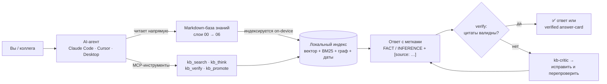
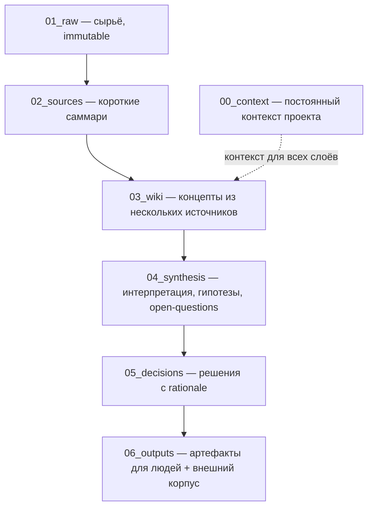
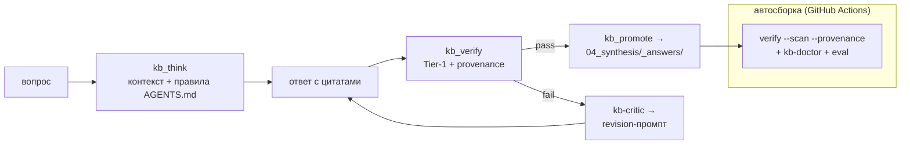

# AI KB Harness — шаблон

> Превращает обычный **markdown-репозиторий в базу знаний**, с которой AI-агент (Claude Code, Cursor,
> Claude Desktop, любой MCP-клиент) работает аккуратно: ищет по смыслу, отвечает **со ссылками на
> источник**, не выдумывает и сам поддерживает порядок.

**В одной фразе:** клонируешь шаблон — и через 10 минут у тебя проект, где нейросеть работает с твоим
контентом как с базой знаний, а не как с чёрным ящиком. Всё **локально**: единственная сетевая
операция — разовая загрузка модели эмбеддингов (~120 MB) при первом индексировании. Нет облачных API,
платных эмбеддингов и Docker.

`on-device` · `MCP-ready` · `0 cloud` · `любая LLM (Claude/GPT/Gemini/Ollama)` · `MIT`

---

## Содержание

1. [Что это и зачем](#что-это-и-зачем)
2. [Как это работает](#как-это-работает)
3. [Кому подходит — прикладные кейсы](#кому-подходит--прикладные-кейсы)
4. [Быстрый старт](#быстрый-старт-5-минут)
5. [Ключевые концепции (от общего к частному)](#ключевые-концепции-от-общего-к-частному)
6. [Инструменты: CLI и MCP](#инструменты-cli-и-mcp)
7. [Типичные рабочие сценарии](#типичные-рабочие-сценарии)
8. [Что внутри](#что-внутри)
9. [Веб-витрина для коллег](#веб-витрина-для-коллег)
10. [SkillOpt — самообучение инструкций](#skillopt--самообучение-инструкций-опционально)
11. [Параметризация, обновление, FAQ](#параметризация-под-свой-проект)

---

## Что это и зачем

Когда работаешь с AI-агентом по живому проекту дольше пары недель, появляются три повторяющиеся боли:

1. **Агент галлюцинирует** про содержимое твоего проекта — он просто не видит нужный файл, потому что
   ты не положил его в контекст, а сам найти не может.
2. **Дисциплина рассуждений плывёт** — факты, гипотезы и решения смешиваются; через месяц в репозитории
   `RECOMMENDATION`, выданные за `FACT`, и непонятно, откуда что взялось.
3. **База знаний копит скрытый долг** — файлы без метаданных, битые ссылки, осиротевшие страницы,
   устаревшие выводы. Руками это никто не вычищает.

Шаблон закрывает эти боли **набором независимых инструментов**, которые работают вместе: локальный
семантический поиск, дисциплина «утверждение → метка → ссылка на источник», механическая проверка
цитат с автоисправлением, и health-check базы. Каждый инструмент полезен сам по себе — можно
остановиться на любом уровне.

> Подробный «почему именно так» и сравнение с похожими подходами — в [FAQ](#faq) и
> [`docs/architecture.md`](docs/architecture.md).

## Как это работает

Агент общается с базой знаний через MCP-инструменты (или читает файлы напрямую). Поиск — локальный
гибридный (смысл + точные термины + связи + даты). Любой ответ обязан быть с метками и ссылками,
а проверка цитат не даёт протащить выдумку:



- **Только локально.** Эмбеддер, БД, поиск, граф, проверки — на твоей машине. В облако ничего не уходит.
- **Любая LLM.** CLI и MCP отдают stdout/JSON — работает с Claude, GPT, Gemini, Ollama и др.
- **Подключение в одну строку.** `.mcp.json` уже настроен — Claude Code подхватывает инструменты сам.
- **Безопасно для git.** Агент пишет только в карантин (`.context/inbox/`) или в проверенные
  answer-cards; решает и коммитит человек.

## Кому подходит — прикладные кейсы

Шаблон не про конкретную профессию — он про **любой проект, где знание копится в документах**, а
нейросеть нужна как ежедневный инструмент, а не для одноразовых задач.

| Кому | Что даёт | Типичный поток |
|---|---|---|
| **Исследователь / аналитик** | Десятки источников, противоречия, evidence в ревизии — без хаоса | источник → саммари → wiki → синтез, ответы со ссылками |
| **Продакт / стратегия** | Дисциплина «факт vs гипотеза vs решение», поиск по истории | ресёрч → open-questions → decisions с rationale |
| **Консалтинг / due diligence** | Много документов, нужна прослеживаемость каждого вывода | ingest пакета → структура → отчёт с цитатами |
| **Инженер (архитектура)** | ADR с явным evidence, backlinks от решения к источникам | decision-карточки + provenance-гейт |
| **Автор (книга / лонгрид / курс)** | Заметки, цитаты, борьба с «я где-то это читал» | raw → wiki → черновики в 06_outputs |
| **Внутренняя база / поддержка** | Переиспользуемые проверенные ответы, не дублирующие друг друга | verified answer-cards (`kb_promote`) |

**Не подходит, если:**
- знание живёт в коде, а не в документах;
- нужна real-time коллаборация в стиле Notion/Confluence (это про solo / small-team с git-workflow);
- объём базы > ~50K страниц (SQLite + on-device эмбеддер упрётся в потолок — нужен Postgres+pgvector).

## Быстрый старт (5 минут)

Требования: **Node 22** (есть `.nvmrc` — `nvm use`), **pnpm** через `corepack enable`.

```bash
# 1. Создать проект из шаблона (или кнопка «Use this template» в GitHub UI)
gh repo create my-project --template ha1ex/ai-kb-harness-template --public --clone
cd my-project

# 2. Поставить зависимости (semantic + skillopt + viewer)
pnpm run setup

# 3. Положить первый источник
mkdir -p 01_raw/research && cp ~/your-doc.md 01_raw/research/2026-01-01-first.md

# 4. Построить индекс (первый раз скачает модель ~120 MB, дальше локально)
pnpm kb:index

# 5. Проверить, что всё живо
pnpm kb:search "тема"        # гибридный поиск
pnpm kb:doctor               # health-check (должен быть EXIT 0)
```

Дальше:
- **Персонализация:** поправь `Project purpose` в [`AGENTS.md`](AGENTS.md), язык/workflow в
  [`CLAUDE.md`](CLAUDE.md), инвариант в [`.remember/core.md`](.remember/core.md), при желании — ручки
  формы ответа в [`.remember/preferences.md`](.remember/preferences.md).
- **MCP в Claude Code:** `.mcp.json` уже настроен — перезапусти Claude Code в проекте, появятся
  инструменты `kb_*`.
- **Веб-витрина для коллег:** `pnpm viewer:dev` → `http://localhost:5173` (см. [ниже](#веб-витрина-для-коллег)).

> **Supply chain:** запускай `pnpm audit`. В шаблоне зафиксирован `pnpm.overrides` на
> `protobufjs>=7.5.8` (закрывает critical-RCE из транзитивной ONNX-зависимости). Viewer-API слушает
> только `127.0.0.1` (наружу — `VIEWER_HOST=0.0.0.0`).

## Ключевые концепции (от общего к частному)

### 1. Слои базы знаний

Всё знание разложено по слоям — от сырого к финальному. Это даёт прослеживаемость: любой вывод можно
размотать до источника.



### 2. Дисциплина утверждений

Каждое нетривиальное высказывание помечается одной из меток и сопровождается ссылкой на источник:

```
FACT: ARR в Q1 = 12М ₽. [source: /02_sources/2026-04-finance.md]
UNKNOWN: retention за 12 месяцев — нет источника.
```

Метки: `FACT` · `INFERENCE` · `ASSUMPTION` · `UNKNOWN` · `RISK` · `DECISION` · `RECOMMENDATION`.
Правила живут в [`AGENTS.md`](AGENTS.md) и **проверяются автоматически** (хуки + CI, см. ниже).

### 3. Гибридный поиск

Локальная ONNX-модель `multilingual-e5-small` индексирует все `.md`. Поиск объединяет несколько
каналов через RRF:

- **вектор** — ловит синонимы и перифразы;
- **BM25** — точные термины и аббревиатуры (NRR, ARR…);
- **граф** — подтягивает документы, связанные через frontmatter `related:` (выигрыш на multi-hop);
- **temporal** — фильтр/буст по дате документа (`--since/--until/--asof/--recency`).

### 4. Контроль качества: verify → critique → CI-гейт

Главный механизм доверия. У базы знаний нет «компилятора», поэтому единственный детерминированный
оракул — **проверка, что цитата ведёт на реально существующий источник нужного слоя**. Вокруг неё —
петля исправления и блокирующий гейт в автосборке:



- **verify** проверяет каждую цитату: файл существует, слой допустим, не указывает на внешний корпус;
  для меток `FACT` добавляет advisory-балл семантического совпадения. Цитаты-примеры в комментариях и
  коде игнорируются.
- **provenance** следит за порядком пирамиды: `synthesis`/`decisions` могут ссылаться только на
  **более низкий** слой (нельзя обосновать вывод ссылкой на свой же уровень).
- **kb-critic** превращает провалы в готовый revision-промпт (`--execute` гоняет цикл «исправил →
  перепроверил» через LLM-CLI, без неё — печатает промпт).
- Всё это стоит **блокирующим шагом в CI** — битая цитата не попадёт в `main`.

### 5. Память: working memory + проверенные answer-cards

- `.remember/core.md` — инвариант проекта (коммитится), `now.md`/`today.md` — сессионные (gitignored).
- `.remember/preferences.md` — ручки **формы ответа** (глубина, плотность цитат, агрессивность `UNKNOWN`),
  подмешиваются в синтез.
- **`kb_promote`** — gated write-path: проверенный ответ сохраняется как переиспользуемая answer-card
  в `04_synthesis/_answers/`, но только если прошёл verify + provenance + не дублирует существующую.
  Если источник потом изменится — `kb-doctor` пометит карту как устаревшую.

### 6. Петля Compose → Adapt → Evolve

Поведение собирается из 8 ортогональных измерений (Context · Memory · Retrieval · Tools · Evaluate ·
Control · Observe · Evolve), а каждый прогон оставляет оценённый след, который возвращается в
улучшение. Полная карта — в [`docs/architecture.md`](docs/architecture.md); разбор внешнего обзора,
из которого пришли verify-петля и answer-cards — в
[`04_synthesis/code-as-agent-harness-adoption.md`](04_synthesis/code-as-agent-harness-adoption.md).

## Инструменты: CLI и MCP

**CLI** (через `pnpm`, см. [`scripts/README.md`](scripts/README.md)):

| Команда | Что делает |
|---|---|
| `pnpm kb:index` | построить/обновить гибридный индекс |
| `pnpm kb:search "запрос"` | гибридный поиск (вектор + BM25 + RRF + граф + temporal) |
| `pnpm kb:think "вопрос"` | собрать промпт-синтез с цитатами и правилами AGENTS.md |
| `pnpm kb:verify --scan --provenance` | проверка цитат + provenance по слоям (гейт CI) |
| `pnpm kb:critic --file ans.md` | revision-промпт по битым цитатам (`--execute` — авто-цикл) |
| `pnpm kb:doctor` | health-check базы (frontmatter, битые ссылки, orphans, stale) |
| `pnpm kb:eval` | retrieval-бенчмарк (recall@k/MRR) + регрессия vs baseline |
| `pnpm kb:dream` | еженедельный LLM-аудит + консолидация фактов (в `.context/`) |
| `pnpm skill …` | SkillOpt CLI (rollout/reflect/diff/apply) |

**MCP-сервер** (`scripts/semantic/mcp-server.mjs`, см. [`scripts/semantic/README.md`](scripts/semantic/README.md)) —
шесть инструментов любому MCP-клиенту:

| Инструмент | Назначение |
|---|---|
| `kb_search` | гибридный поиск, JSON-результат |
| `kb_think` | промпт-контекст под синтез (правила + цитаты + возраст источников) |
| `kb_backlinks` | кто ссылается на файл (blast radius перед правкой) |
| `kb_verify` | проверка цитат + `critique` (что и как исправить) |
| `kb_retain` | write-path: кандидат-заметка → `.context/inbox/` на ревью (не коммит) |
| `kb_promote` | gated write-path: проверенный ответ → `04_synthesis/_answers/` |

## Типичные рабочие сценарии

**A. Новый проект.** `gh repo create … --template …` → `pnpm run setup` → положить источник в
`01_raw/` → `pnpm kb:index`.

**B. Вопрос по базе.** Агент в IDE сам вызывает `kb_search` → `kb_think` и отвечает с метками и
цитатами; `kb_verify` подтверждает, что ссылки настоящие.

**C. Правка важного файла.**
```bash
pnpm kb:search "тема" --explain
node scripts/semantic/backlinks.mjs 03_wiki/foo.md   # кто на меня ссылается
pnpm kb:index                                        # инкрементальная переиндексация
```

**D. Ответ оказался с битыми цитатами.**
```bash
node scripts/kb-critic.mjs --file answer.md          # печатает revision-промпт
node scripts/kb-critic.mjs --file answer.md --execute # авто-цикл verify→revise (если есть claude CLI)
```

**E. Закрепить проверенный ответ как знание.** Через MCP-инструмент `kb_promote` (вопрос + ответ с
цитатами) → карта в `04_synthesis/_answers/`, если прошла verify + provenance + не дубль.

**F. AI плохо следует скиллу.**
```bash
pnpm skill rollout skill-ingest    # 2 из 3 кейсов провалились
pnpm skill reflect <run-id>        # LLM предлагает правку SKILL.md
pnpm skill diff <run-id> && pnpm skill apply <run-id>   # human-in-the-loop
```

## Что внутри

```
ai-kb-harness-template/
├── AGENTS.md                  ← системный промпт для агентов (метки, citation, ingest workflow)
├── CLAUDE.md                  ← operational rules (язык, дисциплина веток, артефакты)
├── .mcp.json                  ← конфиг MCP-серверов (kb-local + skillopt-local)
├── .claude/settings.json      ← permissions + hooks (session-start, pre-tool-use)
├── .remember/
│   ├── core.md                ← semantic invariant проекта (коммитится)
│   └── preferences.md         ← ручки формы ответа (answer-policy)
├── skills/                    ← рабочие процедуры с триггерами (skill-ingest, skill-decision-log)
├── scripts/
│   ├── semantic/              ← ядро поиска/синтеза + MCP-сервер
│   │   ├── lib.mjs            ← вектор/BM25/граф/гибрид, temporal, чанкер, схема БД
│   │   ├── index.mjs · search.mjs · think.mjs · backlinks.mjs · rerank.mjs
│   │   ├── verify.mjs         ← проверка цитат (Tier-1 gate + FACT-advisory + critique + --scan)
│   │   ├── eval.mjs · test-retrieval.mjs · test-control.mjs   ← бенчмарк + офлайн-тесты (гейты CI)
│   │   └── mcp-server.mjs     ← kb_search/think/backlinks/verify/retain/promote
│   ├── lib/                   ← dependency-free утилиты
│   │   ├── provenance.mjs     ← порядок пирамиды + маскирование примеров цитат
│   │   └── journal.mjs        ← append-only журнал операций (.context/)
│   ├── kb-doctor.mjs          ← health-check (+ advisory: stale inbox/answer-cards)
│   ├── kb-critic.mjs          ← петля verify→critique→revise (N1)
│   ├── check-decisions.mjs · check-md-frontmatter.mjs · check-provenance.mjs  ← PreToolUse hooks
│   ├── dream-cycle.mjs · suggest-links.mjs · session-start-context.mjs · parse-raw.mjs
│   └── skillopt/              ← самообучение SKILL.md (rollout/reflect/diff/apply) + MCP
├── tools/viewer/              ← локальная веб-витрина базы (Vite + React + Tailwind)
└── 00_context … 06_outputs/   ← слои базы знаний (см. AGENTS.md)
```

## Веб-витрина для коллег

Для тех, кто не лезет в терминал — локальный веб-интерфейс (`tools/viewer/`):

```bash
pnpm viewer:dev     # API на :3001 + клиент на http://localhost:5173
```

Главная с обзором слоёв · автогенерируемый sidebar · рендер любого `.md` с дизайн-системой и
backlinks · поиск (тот же hybrid retrieval) · интерактивный граф связей (Sigma) ·
open-questions/contradictions · дашборд SkillOpt. Для коллег: `pnpm viewer:build` → статический сайт.

## SkillOpt — самообучение инструкций (опционально)

Превращает скиллы из статических `SKILL.md` в документы с метриками: `rollout` (прогон eval-кейсов
через LLM) → `reflect` (LLM предлагает правки) → `diff`/`apply` (human-in-the-loop). Работает с любой
нейронкой (claude CLI, OpenAI HTTP, Ollama, любой OpenAI-совместимый endpoint). Защита от ошибок:
`reflect` не работает при <5 кейсах или 100% pass-rate; `apply` отказывается на грязном working tree;
бэкап + `revert`. Идея вдохновлена [microsoft/SkillOpt](https://microsoft.github.io/SkillOpt/), но без
привязки к Azure. Детали и форматы eval-кейсов — в [`scripts/README.md`](scripts/README.md).

---

## Параметризация под свой проект

Большинство кода — generic. Что обычно подкручивают:

| Файл | Что менять |
|---|---|
| `AGENTS.md` § Project purpose | Цель и контекст проекта |
| `CLAUDE.md` | Язык, дисциплина веток, команды запуска |
| `.remember/core.md` · `preferences.md` | Инвариант проекта и форма ответа |
| `scripts/semantic/lib.mjs` → `INDEXABLE_LAYERS` / `SKIP_DIRS` | Своя структура слоёв |
| `scripts/lib/provenance.mjs` → `PROVENANCE_ENFORCED_LAYERS` | Для каких слоёв включать provenance-гейт |
| `scripts/kb-doctor.mjs` / `check-md-frontmatter.mjs` | Обязательные frontmatter-поля по слоям |
| `.mcp.json` · `LICENSE` | Имя сервера · copyright holder |

**Не нужно** менять алгоритмы поиска (`lib.mjs`), MCP-handler'ы и логику гейтов — они generic.

## Как обновляться от upstream

GitHub-шаблоны не обновляют клоны автоматически. Чтобы догонять улучшения:

```bash
git remote add upstream https://github.com/ha1ex/ai-kb-harness-template.git
git fetch upstream
git diff upstream/main -- scripts/                       # что изменилось
git checkout upstream/main -- scripts/semantic/lib.mjs   # цеплять конкретные файлы
```

## FAQ

**Зачем on-device, а не облачные эмбеддинги?** Нулевая стоимость и задержка после первого запуска,
никаких утечек базы в чужие сервисы. `multilingual-e5-small` (384-dim) для ru/en достаточен.

**Почему sqlite-vec, а не Qdrant/Postgres+pgvector?** Один файл, нет процесса/порта/миграций. До ~50K
чанков — молниеносно. Упрёшься — `lib.mjs` написан так, что смена бекенда = переписать `openDb` + три
функции поиска.

**Почему MCP, а не Bash-allowlist?** MCP-инструменты видны агенту как first-class с типизированной
схемой; это стандарт (Claude Code/Desktop, Cursor, Windsurf).

**Работает с GPT/Gemini/open-source?** Да. CLI отдаёт stdout/JSON; MCP — открытый стандарт. Хуки
`.claude/settings.json` специфичны для Claude Code, но адаптируются под Cursor/Windsurf.

**Можно без AI-агента, как поиск по markdown?** Да — `pnpm kb:search` полезнее `grep -r` (смысл +
термины + связи + цитаты).

**Что за `kb_retain` / `kb_promote` / `.context/inbox/`?** Контролируемые write-path: `kb_retain`
кладёт черновик в карантин на ревью; `kb_promote` сохраняет **проверенный** ответ как answer-card.
Агент получает «память», не нарушая git-дисциплину.

## Происхождение и кредиты

- Идея «brain = markdown-репо + структурированный AI-доступ» вдохновлена
  [gbrain](https://github.com/garrytan/gbrain). Здесь — реализация без платных эмбеддингов и Postgres:
  Node + sqlite-vec + on-device ONNX.
- Идея «харнесс определяет качество» и петля Compose→Adapt→Evolve — см. [`docs/architecture.md`](docs/architecture.md).
- Петля verify→critique→revise, provenance-гейт и verified answer-cards — перенос идей из обзора
  *Code as Agent Harness* (разбор: [`04_synthesis/code-as-agent-harness-adoption.md`](04_synthesis/code-as-agent-harness-adoption.md)).
- `multilingual-e5-small` (Microsoft, MIT), `sqlite-vec` (Alex Garcia, MIT), MCP SDK (Anthropic).

## Лицензия

MIT — см. [LICENSE](LICENSE).
